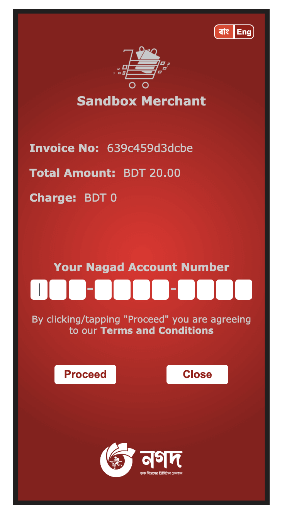
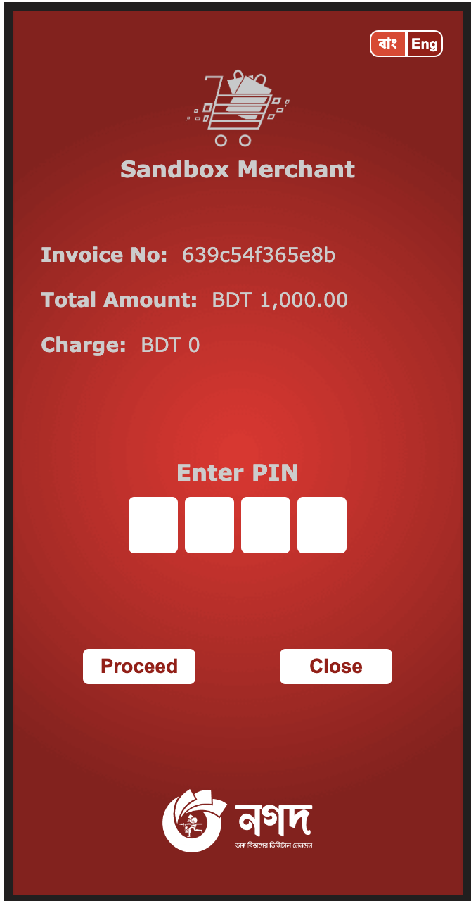

# Nagad Payment Gateway for PHP/Laravel Framework

[](https://packagist.org/packages/karim007/laravel-nagad)
[](https://packagist.org/packages/karim007/laravel-nagad)

## Features

This is a php/laravel wrapper package for [Nagad MFS](https://nagad.com.bd/)

## Requirements

- PHP >=7.4
- Laravel >= 6


## Installation

```bash
composer require karim007/laravel-nagad
```


## Examples





For  video tutorial click the image bellow or https://youtu.be/xue4EP5et58

[](https://youtu.be/xue4EP5et58)


### vendor publish (config)

```bash
php artisan vendor:publish --provider="Karim007\LaravelNagad\NagadServiceProvider"
```

After publish config file setup your credential. you can see this in your config directory nagad.php file

```
"sandbox"         => env("NAGAD_SANDBOX", true), // if true it will redirect to sandbox url

"merchant_id"     => env("NAGAD_MERCHANT_ID", ""),
"merchant_number" => env("NAGAD_MERCHANT_NUMBER", ""),
"public_key"      => env("NAGAD_PUBLIC_KEY", ""),
"private_key"     => env("NAGAD_PRIVATE_KEY", ""),
"callback_url"    => env("NAGAD_CALLBACK_URL", "http://127.0.0.1:8000/nagad/callback"), // By default you can change it in your callback url

"merchant_id_2"     => env("NAGAD_MERCHANT_ID2", ""),
"merchant_number_2" => env("NAGAD_MERCHANT_NUMBER2", ""),
"public_key_2"      => env("NAGAD_PUBLIC_KEY2", ""),
"private_key_2"     => env("NAGAD_PRIVATE_KEY2", ""),
"callback_url_2"    => env("NAGAD_CALLBACK_URL2", "http://your_domain/nagad/callback"),

//you can add more account as your wise

'timezone'        => 'Asia/Dhaka', // By default
"response_type"   => "json" // By default json you can change response type json/html
```

### Set .env configuration

```
NAGAD_SANDBOX=true #for production use false

NAGAD_MERCHANT_ID=""
NAGAD_MERCHANT_NUMBER=""
NAGAD_PUBLIC_KEY=""
NAGAD_PRIVATE_KEY=""
NAGAD_CALLBACK_URL=""

NAGAD_MERCHANT_NUMBER2=
NAGAD_MERCHANT_ID2=
NAGAD_PUBLIC_KEY2=
NAGAD_PRIVATE_KEY2=
NAGAD_CALLBACK_URL2=


```

## Usage
### 1. create a controller
```
php artisan make:controller NagadController
```

### 2. add this routes
```
Route::get('nagad/pay',[App\Http\Controllers\NagadController::class,'pay'])->name('nagad.pay');
Route::get('nagad/callback', [App\Http\Controllers\NagadController::class,'callback']);
Route::get('nagad/refund/{paymentRefId}', [App\Http\Controllers\NagadController::class,'refund']);

```

### 3. Create Payment

#must be included in your controller
```
use Karim007\LaravelNagad\Facade\NagadPayment;
use Karim007\LaravelNagad\Facade\NagadRefund;
```


```
public function pay()
{
    $amount = 1000;
    $trx_id = uniqid();
    //if you have multipule/dynamic callback url then uncomment bellow line and use dynamic callbackurl
    //otherwise don't do anything
    //config(['nagad.callback_url' => env('NAGAD_CALLBACK_URL')]);
    
    $response = NagadPayment::create($amount, $trx_id); // 1st parameter is amount and 2nd is unique invoice number

    //$response = NagadPayment::create($amount, $trx_id,1); // additional last parameter for manage difference account

    if (isset($response) && $response->status == "Success"){
        return redirect()->away($response->callBackUrl);
    }
    return redirect()->back()->with("error-alert", "Invalid request try again after few time later");
}
```


### 4. Verify Payment

```
public function callback(Request $request)
{
    if (!$request->status && !$request->order_id) {
        return response()->json([
            "error" => "Not found any status"
        ], 500);
    }

    if (config("nagad.response_type") == "json") {
        return response()->json($request->all());
    }

    $verify = NagadPayment::verify($request->payment_ref_id); // $paymentRefId which you will find callback URL request parameter

    if (isset($verify->status) && $verify->status == "Success") {
        return $this->success($verify->orderId);
    } else {
        return $this->fail($verify->orderId);
    }

}
```

### 5. Refund Payment

```

public function refund($paymentRefId)
{
    $refundAmount=1000;
    $verify = NagadRefund::refund($paymentRefId,$refundAmount);
    //$verify = NagadRefund::refund($paymentRefId,$refundAmount,'','sss',1); last parameter for manage account

    if (isset($verify->status) && $verify->status == "Success") {
        return $this->success($verify->orderId);
    } else {
        return $this->fail($verify->orderId);
    }
}

```
<span style="color: #96d0ff">Note: For the refund method, you have to pass two more parameters one is <b>reference no</b> and another
<b>reference message</b></span>

### 5. success function
```
public function success($transId)
{
    return view("nagad::success", compact('transId'));
}
```

### 6. fail function
```
public function fail($transId)
{
    return view("nagad::failed", compact('transId'));
}
```

###Note
- >In live mode integration Note
- 1. login nagad panel
- 2. got to Mercent management->Marcent integrartion details
- 3. On the top of this page you will see Marcent ID use it as your env "NAGAD_MERCHANT_ID"
- 4. You will see by default have a titled "Nagad payment gateway server public key" download it or copy and use it as your env "NAGAD_PUBLIC_KEY"
- 5.  Then below you will see "Generate key (**only for download)" then click on "Key Generate" buttion
- 6. after click it will generate 2 keys *_pri.pem and *_pub.pem download it and keep safe please because envey time it generate new
- 7. *_pri.pem generate key use for your env "NAGAD_PRIVATE_KEY"
- 8. then got to "Marcent Integration" menu  select integration type E-Commerch form drop down
- 9. give you callback URL domain_name/nagad/callback [if your callback url is other then use your own callback url]
- 10. upload your downloaded *_pub.pem (it is after generate button clicked public key not default showing public key default showing public key you already use your env file on step 4 it is very important don't mitch match it)
- 11. then submit after submit you see the callbackurl and pub key
- 12. okk your job is done
- "NAGAD_MERCHANT_NUMBER" is your provide merchant number must be use it in env

- NB: live mode is not work in local. project must be upload in server. if your server is out of bd like us, singapur etc server. You need to contact with nagad and you need to provide them your server IP and your callback URL then they whitelisted your IP and callback function from their end. after that your payment gateway will be working.

- Thank you have a good day.


Contributions to the Nagad Payment Gateway package are welcome. Please note the following guidelines before submitting your pull
request.

- Follow [PSR-4](http://www.php-fig.org/psr/psr-4/) coding standards.
- Read Nagad API documentations first. Please contact with Nagad for their api documentation and sandbox access.

## License

This repository is licensed under the [MIT License](http://opensource.org/licenses/MIT).

Copyright 2022 [md abdul karim](https://github.com/karim-007). We are not affiliated with Nagad and don't give any guarantee. 
